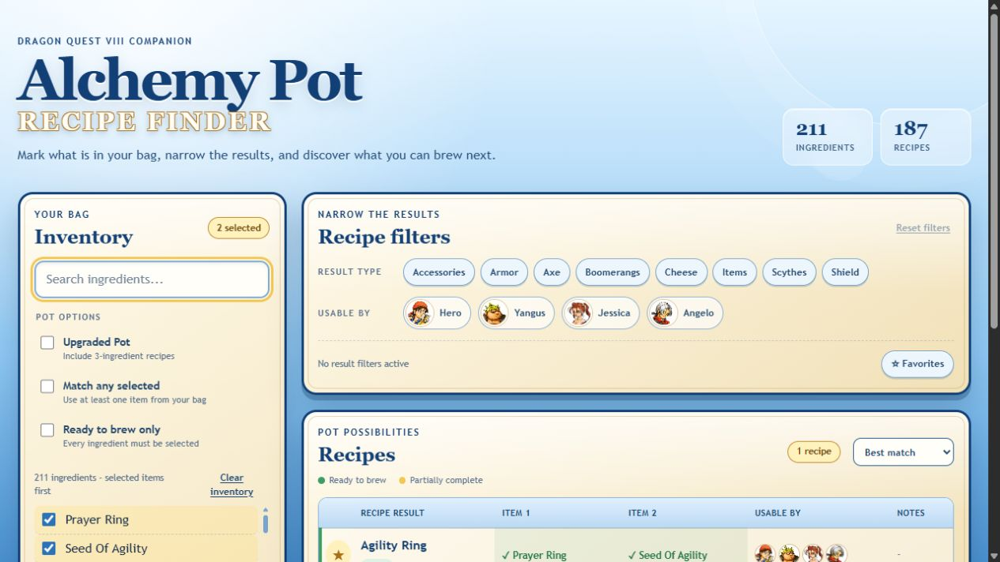

# DQ8 Alchemy Pot Recipe Finder

A fast, mobile-friendly recipe companion for the Alchemy Pot in **Dragon Quest VIII**. Mark the items in your inventory and the app immediately shows what you can brew, what is almost complete, and which ingredients are still missing.

[Open the live app](https://galesongas.github.io/DQ8Alchemy/)



## Highlights

- Search and track 211 possible ingredients
- Browse 187 two- and three-ingredient recipes
- Keep selected inventory items at the top of the list
- See ready and partially complete recipes at a glance
- Add a missing ingredient directly from a recipe
- Filter results by equipment type and playable character
- Include upgraded three-ingredient recipes when needed
- Match every selected item or any selected item
- Show only recipes that are ready to brew
- Favorite recipes and sort results by relevance or name
- Preserve inventory, filters, favorites, and sorting between visits
- Use a responsive card layout on phones and a compact table on larger screens

The hosted version needs no account or installation. Everything runs locally in the browser and no usage data is collected.

## How to use it

1. Search or browse the **Inventory** panel.
2. Select every ingredient currently in your bag.
3. Review the recipes ordered by their match with your inventory.
4. Select a missing ingredient inside a recipe to add it to your inventory.
5. Use result-type or character filters to narrow the list.
6. Enable **Upgraded Pot**, **Match any selected**, or **Ready to brew only** when useful.
7. Star useful recipes and use **Favorites** to return to them quickly.

Selected ingredients, filters, favorites, and sorting are saved with `localStorage`. They stay on the current device and browser. Resetting recipe filters does not erase the inventory or favorites.

## Run locally

Clone the repository and serve its root directory with any static server:

```powershell
python -m http.server 8000
```

Then open `http://localhost:8000`. Opening `index.html` directly may prevent some browsers from loading the JSON data files.

No build step or third-party frontend dependency is required.

## Project layout

```text
DQ8Alchemy/
|-- index.html          Semantic application structure
|-- styles.css          Dragon Quest-inspired responsive theme
|-- app.js              State, filtering, persistence, and rendering
|-- data/
|   |-- items.json      Item names, categories, and character metadata
|   `-- recipes.json    Recipe results, ingredients, and notes
|-- img/chars/          Character filter icons
`-- docs/preview.png    README preview
```

## Data format

Each item has a stable `id`, a display `name`, and optional `category`, `usableBy`, and `isIngredient` fields. Recipes reference those IDs through `resultId` and `ingredientIds`.

Changes to the JSON files should keep every referenced ID valid. Multiple recipes may intentionally produce the same result.

## Contributing

Corrections to recipe data, missing combinations, accessibility improvements, and focused interface refinements are welcome. Keep the application lightweight and compatible with static GitHub Pages hosting.

## Disclaimer

This is an unofficial, fan-made companion. Dragon Quest VIII and its related names and imagery are property of their respective rights holders.

If the tool saved you a few trips to a wiki, you can [support its development on Ko-fi](https://ko-fi.com/galesong).
